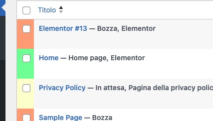

# Custom Post Status Colors

**The simplest WordPress plugin in the world!** 🎨

Colorize your WordPress post list with visual status indicators. One file, zero configuration, instant results.

[](https://www.gnu.org/licenses/gpl-2.0.html)
[](https://wordpress.org/)
[](https://www.php.net/)

## Why This is the Simplest Plugin Ever

✨ **One single file** - No complex file structure  
⚡ **Zero configuration** - Just activate and go  
🎯 **Zero settings page** - No options to configure  
🚀 **Instant results** - Works immediately after activation  
📦 **Lightweight** - Less than 2KB total size  
🔧 **Zero dependencies** - Pure WordPress core functionality

## What It Does

Adds subtle background colors to the checkbox column in your WordPress post list based on post status:

| Status | Color | Hex Code |
|--------|-------|----------|
| 📝 Draft | Light Red (Salmon) | `#FFA07A` |
| ⏳ Pending Review | Light Yellow | `#FFFACD` |
| ✅ Published | Light Green | `#98FB98` |
| 🔒 Private | Light Gray | `#E0E0E0` |

## Installation

### From GitHub

1. Download the latest release or clone this repository
2. Upload `custom-post-status-colors.php` to `/wp-content/plugins/custom-post-status-colors/`
3. Activate the plugin through the 'Plugins' menu in WordPress
4. That's it! No configuration needed.

### Manual Installation

1. Download the `custom-post-status-colors.php` file
2. Go to WordPress Admin → Plugins → Add New → Upload Plugin
3. Choose the file and click "Install Now"
4. Activate the plugin
5. Done!

## Requirements

- WordPress 6.0 or higher
- PHP 7.4 or higher

## Screenshot



*Visual differentiation of post statuses in the WordPress admin - Draft (orange), Published (green), Pending (yellow)*

## Why So Simple?

This plugin demonstrates that not every WordPress plugin needs:
- Complex settings pages
- Database tables
- Multiple files and folders
- Complicated configuration

Sometimes, the best solution is the simplest one. This plugin does exactly one thing, and it does it perfectly with just a few lines of code.

## Frequently Asked Questions

### Can I customize the colors?

The plugin uses predefined colors that work well with most WordPress themes. If you need custom colors, you can modify the hex values in the plugin file or add custom CSS to your theme.

### Does it work with custom post types?

Yes! The plugin works with all post types in WordPress.

### Does it affect performance?

No! The plugin only adds a tiny CSS snippet to the admin area. Zero impact on frontend performance.

### Can I use this in a commercial project?

Yes! This plugin is released under GPL v2 or later license, which means you can use it freely in both personal and commercial projects.

## Changelog

### 1.0.0 - 2024
- 🎉 Initial release
- ✅ Added colors for Draft, Pending, Published statuses
- 🔒 Added color for Private status
- 📝 Followed all WordPress Plugin Review Guidelines
- 🛡️ Implemented proper prefixing and security best practices

## Support & Contribution

Found a bug or have a suggestion? Please open an issue on [GitHub](https://github.com/alfredo-villa/custom-post-status-colors/issues).

Want to contribute? Pull requests are welcome!

## License

This plugin is licensed under the [GPL v2](LICENSE).

```
This program is free software; you can redistribute it and/or modify
it under the terms of the GNU General Public License as published by
the Free Software Foundation; either version 2 of the License, or
(at your option) any later version.

This program is distributed in the hope that it will be useful,
but WITHOUT ANY WARRANTY; without even the implied warranty of
MERCHANTABILITY or FITNESS FOR A PARTICULAR PURPOSE. See the
GNU General Public License for more details.
```

## Author

**Alfredo Villa**
- Website: [https://github.com/alfredo-villa](https://github.com/alfredo-villa)
- Email: [info@alfredovilla.it](mailto:info@alfredovilla.it)
- GitHub: [@alfredo-villa](https://github.com/alfredo-villa)

---

Made with ❤️ and simplicity in mind | **The World's Simplest WordPress Plugin**
